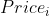
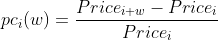
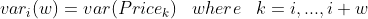
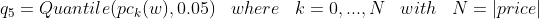
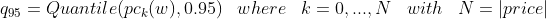
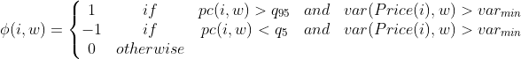
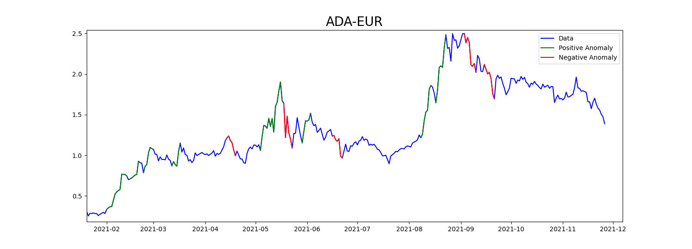

# FAD - Financial Anomaly Detection based on Nowcasting

Libraries: 

Dependences:

## Contents
- [Description](#description)
- [Goal](#goal)
- [Dataset](#dataset)
- [Anomaly Definition](#anomaly-definition)
  - [Price Change Based](#price-change-based)
  - [Triple Barrier](#triple-barrier)
  - [Meta-Labeling](#meta-labeling)
- [Analysis](#analysis)
  - [Feature Engineering](#feature-engineering)
  - [Fractionally Differentiated Features](#fractionally-differentiated-features)
  - [Feature Selection](#feature-selection)
- [Models](#models)

## Description
In this project I want to develop a AI algorithm able to understand when an **anomaly** affects the _price trend_. Instead of solving the forecasting problem, I want to focus on the **nowcasting problem**, _i.e. prediction of the present, the very near future_. 

Forecasting problem are very difficult to be launch in real-case use, because they are not able to predict an external shock, given by a news or anything else, infact they are very poor againts the many external sources of shock. 

**Nowcasting** does not take the responsability to predict the future, as forecasting does, but it tries to predict the actual state or the near future. For this reason, I'm developing this project for **preventing some shock** that could affect the price trend of a financial product.

## Goal
Given a window, the **FAD model** detects if the window is **normal** or **anomalous**

## Dataset
The dataset is provided by the yahoo finance API _(yfinance)_. I focus mainly on **Crypto** data.

## Anomaly Definition
  - [Price Change Based](#price-change-based)
  - [Triple Barrier](#triple-barrier)
  - [Meta-Labeling](#meta-labeling)
### Price Change Based
#### Assumptions
- Assuming the **Price** function, that returns the price value at the timestamp **i**:

- Let's define the **price change** *pc* on **window** *w* as following:

- Let's consider the **variance** function that returns a variance of the price relative to a defined window **w**:

- Now let's take the 5% and 95% quantile of **pc_w** and set the **minimum variance** to take into account:

- Given a var_min, as the minum variance to take into account, an **anomaly window** is defined as following:

Example of anomaly labeling with **price change based** labeling method:

### Triple Barrier
WIP
### Meta-Labeling
WIP
## Analysis

### Feature Engineering
WIP

### Fractionally Differentiated Features
De Prado in [1] explains the **'stationary vs memory dilemma'**: in finance the time-series are non-stationary, due to
the presence of the memory in the time-series itself. Transforming the time-series obtaining a stationary trend
(i.e. computing the return on price or the changes in volatility, ecc.), led to lose the memory from the time-series.
"**Memory is the basis of predictive power for models, but stationarity is a necessary property for inferencial purposes**.
The **dilemma** is that **returns** are **stationary**, however **memory-less**, and **prices have **memory**,
however they are **non-stationary**."

The idea is transforming the time-series in order to consider it as **stationary**, where **not all memory is erased**.

The **Fractionally Differentiation** corresponds to the difference operation but with non-integer steps:

Here it is an example of the analysis for **Cardano** Cryptocurrency (ADA-EUR)

The dashed red line represents the **95% confidence** for the **Adfueller test**.

From this analysis you can see that with a **fractional differentiation** of ADA-EUR price between [**0.3**; **0.45**]
you get a transformed time-series that holds the **stationary** assumption with confidence around **95% confidence**, **maintaining** 
a still high **correlation** with the original time-series around **0.9**

### Feature Selection
WIP

## Models
WIP

# References

[1]. "Advances in Financial Machine Learning" by Marcos Lopez de Prado, 2018

